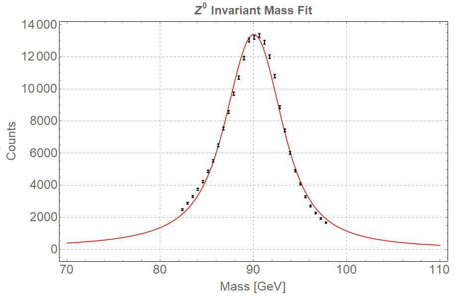

 <h1> $Z\rightarrow e^+e^-$ </h1> 

---
## Contents

1. [Theory](#1-theory)
2. [Parameter Analysis](#2-parameter-analysis)
3. [Cone Cuts](#3-cone-cuts)
4. [Mass Distribution](#4-mass-distribution)
5. [Cross Section](#5-cross-section)
	* [Uncertainties](#uncertainties)
	* [Final Value](#final-value)
6. [Mass Resonance Fit](#6-mass-resonance-fit)

---

## 1. Theory

The most easily identified decay mode of the $Z$ boson is to a pair of charged leptons. This is written as $Z\rightarrow l^+l^-$ where $l$ denotes a particular lepton flavour ($l = e, \mu, \tau$). A Feynman diagram representing this process is available below

#### Figure 1: The Feynman diagrams for the decay processe $Z\rightarrow l^+l^-$. This is only the most simple diagram that describes the $Z\rightarrow l^+l^-$ process.

However, this is not the most probable decay process a Z boson can go through. A breakdown of what the $Z$ can decay to is given below
1. In 10% of the $Z$-decays, charged lepton-antilepton pairs are produced. The three possible charged lepton pair types are electron-positron, muon-antimuon, and tau-antitau pairs. Each pair is approximately equally probable.
2. The $Z$ boson decays in 20% of the cases into a neutrino-antineutrino pair. Our detector is not capable of detecting neutrinos since they almost don't interact with anything (no electric charge). The neutrinos are therefore invisible to us and the only way we can “see” them is when we measure that there is some energy or transverse momentum missing after the collision (since we know that both transverse momentum and energy should be conserved in the collision).
3. In 70% of $Z$ decays, a quark-antiquark pair is produced. These appear as particle showers called “jets“ in the detector. Quarks have a property we call "colour", and each quark comes in 3 colours.

Furthermore, there are multiple other processes that decay into leptons with similar characteristics as the $Z$ decay products. A list of some of them, which could be simulated and thus accurately removed, are available [here](index.md#data-sets-and-simulations).

Another important contribution to the background is given by [QCD processes](https://arxiv.org/abs/hep-ph/0111420). These are intrinsically very hard to simulate and thus no Monte Carlo is available.

In this part of the experiment we tried to apply cuts on various parameters of the decay electrons to refine our measurements. The ideal is to obtain a set of electrons which are only from the decay of the $Z^0$. Obviously, that is not achievable and backgrounds still remain in the data. However, in the Z boson case, these backgrounds are insignificant as they do not skew the invariant mass distribution of the lepton pair in a meaningful way.

What follows is our attempts to refine the data such that we get as close as we can to the previously mentioned ideal.

## 2. Parameter Analysis

As per the $Z\rightarrow\mu^{-}\mu^{+}$ case, the initial criteria for the $Z\rightarrow e^+e^-$ process is the existence of at least **_two leptons with opposite charges_**. On physical grounds, explained in [Section 1](#1-theory), only the highest [$p_T$](index.md#variable-names) was selected.
The parameters involved in the [invariant mass calculation](index.md#invariant-mass) for the electron pair have been plotted separately, superimposed with some of the existing background electron parameters deduced from Monte Carlo simulations. The Monte Carlo simulation for the signal process, i.e. $Z\rightarrow e^+e^-$, is also presented on this graph. All the plots can be viewed in the slider below.



Again, cuts on $\eta$ and $\phi$ do not present much interest. However, in the case of electron decay, cuts were taken on [$p_T$](index.md#bariable-names) and [$E$](index.md#bariable-names). Based on the plots from Slider 1, we decided to cut at the points where **$p_T > 20$ GeV and $E>$ 40 GeV**, since this is where the signal dominates.

## 3. Cone Cuts

After applying the cuts detailed in the previous section, the [$P_T^\mathrm{cone}$](index.md#variable-names) and the [$E_T^\mathrm{cone}$](index.md#variable-names) of the filtered electrons were plotted. These plots are available in the slider below.



Considering the above figures, we decided to refine our electron selection process by adding cuts on the $P_T^\mathrm{cone}$ and $E_T^\mathrm{cone}$ parameters. Thus, only electrons that have **$P_T^\mathrm{cone}<$ 5 GeV and $E_T^\mathrm{cone}<$ 5 GeV** were allowed.

## 4. Mass Distribution

The electrons that pass all the selection cuts detailed in [Section 2](#2-parameter-analysis) and [Section 3](#3-cone-cuts) were used to calculate the [invariant mass](index.md#invariant-mass). Moreover, the cuts on the cones was varied from 3 Gev to 7 GeV in steps of 1 GeV (symmetric interval around original cut of 5 GeV). Our principal cut was kept at 5 GeV. The variation was done to obtain an estimate of the systematic error on the cross section. Mass resonance curves were obtained for each of these cuts.



Again, there is no significant difference between the plots in the above slider. The cross section values obtained from each of these were used in estimating the systematic uncertainty on the final cross section value.

## 5. Cross Section

The cross section for each of the five invariant mass distributions was calculated using the method detailed [here](index.md#cross-sections). A plot of the five cross section values is available below.



At the **5 GeV cone cut**, we obtain a value of **$\sigma_{Zee} = 1.20$ nb** (nanobarns).
In the next sections we will discuss the uncertainty on this value, i.e. at a **6 GeV cone cut**.

## Uncertainties

In this section we state the considered sources of uncertainty and their quantitative estimates.

#### Statistical Uncertainty

The statistical uncertainty of $\sigma_{Zee}$ was determined by propagating the errors on the calculated efficiency, number of signal counts and number of background counts. An exact description of the error propagation process can be found [here](index.md#uncertainties).

A final estimate of the **statistical uncertainty** on the calculated cross-section is **0.01 nb**.

#### Systematic Uncertainty
TThe systematic uncertainty was estimated using the plot of the five cuts and cross section calculation at equivalent intervals of $\eta$. Details of why and how this is done are available [here](index.md#uncertainties). 

A final estimate of the **systematic uncertainty** on the calculated cross-section is **0.12 nb**.

#### Luminosity Uncertainty
Finally, the uncertainty on the luminosity was taken to be **0.02 nb**.

## Final Value
Finally, we quote the final value for the cross section obtained in the $Z\rightarrow e^+e^-$ process to be
\begin{equation}
\sigma_{Zee} = 1.20\pm 0.01 \mathrm{(stat)}\pm 0.12 \mathrm{(syst)}\pm 0.02 \mathrm{(lumi)}
\end{equation}

## 6. Mass Resonance Fit

The invariant mass distribution of the $Z\rightarrow ee$ process was fitted. A detailed explanation of the fitting process can be found [here](Zmumu.md#fitting-process).

### Results of the fitting

Mathematica was used to fit the convolution to the data. A figure of the fitted data is available below.

This fit has a reduced $\chi^2 = 5.89$ with a probability of obtaining this value of $P=1.54\times 10^{-16}$. Table of the fitted parameters:

|           | Estimate | Standard Error | t-Statistic |     P-Value    |
|:---------:|:--------:|:--------------:|:-----------:|:--------------:|
| $\lambda$ |  271635. |     1566.49    |   173.404   | 4.92122*10^-40 |
|  $\sigma$ |  0.85068 |    0.104545    |   8.13697   |  1.72187*10^-8 |
|    $M$    |  90.7495 |    0.015869    |   5718.66   | 5.50204*10^-78 |
|  $\Gamma$ |  5.8301  |    0.107572    |   54.1973   | 1.90166*10^-27 |