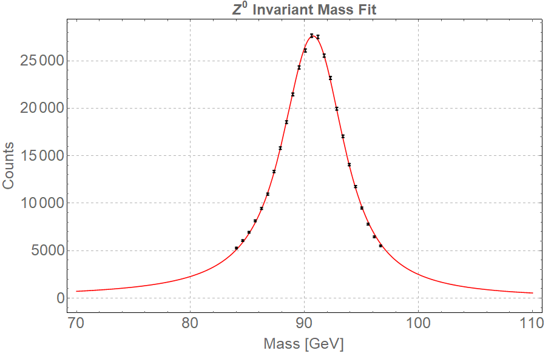

 <h1>  $Z\rightarrow\mu^+\mu^-$ </h1> 

---
## Contents

1. [Theory](#1-theory)
2. [Parameter Analysis](#2-parameter-analysis)
3. [Cone Cuts](#3-cone-cuts)
4. [Mass Distribution](#4-mass-distribution)
5. [Cross Section](#5-cross-section)
	* [Uncertainties](#uncertainties)
	* [Final Value](#final-value)
6. [Mass Resonance Fit](#6-mass-resonance-fit)

---

## 1. Theory

The most easily indetified deacay mode of the $Z$ boson is to a pair of charged leptons. This is written as $Z\rightarrow l^+l^-$ where $l$ denotes a particular lepton flavour ($l = e, \mu, \tau$). A Feynman diagram is shown in Figure 1.

#### Figure 1: The Feynman diagrams for the decay processe $Z\rightarrow l^+l^-$. This is only the most simple diagram that describes the $Z\rightarrow l^+l^-$ process.

However, this is not the most probable decay process a $Z$ boson can go through. A breakdown of what the $Z$ can decay to is given below
1. In 10% of the $Z$-decays, charged lepton-antilepton pairs are produced. The three possible charged lepton pair types are electron-positron, muon-antimuon, and tau-antitau pairs. Each pair is approximately equally probable.
2. The Z boson decays in 20% of the cases into a neutrino-antineutrino pair. Our detector is not capable of detecting neutrinos since they almost don't interact with anything (no electric charge). The neutrinos are therefore invisible to us and the only way we can “see” them is when we measure that there is some energy or transverse momentum missing after the collision (since we know that both transverse momentum and energy should be conserved in the collision).
3. In 70% of $Z$ decays, a quark-antiquark pair is produced. These appear as particle showers called “jets“ in the detector. Quarks have a property we call "colour", and each quark comes in 3 colours.

Furthermore, there are multiple other processes that decay into leptons with similar characteristics as the $Z$ decay products. A list of some of them, which could be simulated and thus accurately removed, are available [here](index.md#data-sets-and-simulations).

Another important contribution to the background is given by [QCD processes](https://arxiv.org/abs/hep-ph/0111420). These are intrinsically very hard to simulate and thus no Monte Carlo simulation is available.

In this part of the experiment we tried to apply cuts on various parameters of the decay muons to refine our measurements. The ideal is to obtain a set of muons which are only from the decay of the $Z^0$. Obviously, that is not achievable and backgrounds still remain in the data. However, in the $Z$ boson case, these backgrounds are insignificant as they do not skew the invariant mass distribution of the lepton pair in a meaningful way.

What follows is our attempts to refine the data such that we get as close as we can to the previoulsy mentioned ideal.

[[back to top]](#contents)

## 2. Parameter Analysis

As a first criteria for the $Z\rightarrow\mu^+\mu^-$ process, we are selecting events in which there are at least **_two muons, one positive and one negative_**. On physical grounds, explained in [Section 1](#1-theory), **only the highest [$p_T$](index.md#variable-names) muon pair was selected**.
The parameters involved in the [invariant mass calculation](index.md#invariant-mass) for the muon pair have been plotted separately, superimposed with some of the existing background muon parameters deduced from [Monte Carlo simulations](#data-sets-and-simulations). The Monte Carlo simulation for the signal process, i.e. $Z\rightarrow\mu\mu$, is also presented on this graph. All the plots can be viewed in the slider below.



From these, one can see that cuts on $\eta$ and $\phi$ would not be very lucrative. However, high $p_T$ signal muons dominate over all the other (simulated) sources in the [Muon data](index.md#data-sets-and-simulations).

[[back to top]](#contents)

## 3. Cone Cuts

After applying the cuts detailed in the previous section, the [$P_T^\mathrm{cone}$](index.md#variable-names) and the [$E_T^\mathrm{cone}$](index.md#variable-names) of the filtered muons were plotted. These plots are available below.



After studying these figures, we added one more selection cut based on the $P_T^\mathrm{cone}$ and $E_T^\mathrm{cone}$ parameters. Thus, we only recorded muons that have **both $P_T^\mathrm{cone}$ and $E_T^\mathrm{cone}$ lower than 6 GeV**.
As an aside, before settling on the 6 GeV cut, the effect of various cone cuts on the other parameter plots from [Section 2](#2-parameter-analysis) was studied. These show superimposed plots of the parameters at different cone cuts in GeV (both $P_T^\mathrm{cone}$ and $E_T^\mathrm{cone}$ were cut at the same value).



[[back to top]](#contents)

## 4. Mass Distribution

The muons that pass all the selection cuts detailed in [Section 2](#2-parameter-analysis) and [Section 3](#3-cone-cuts) were used to calculate the [invariant mass](index.md#invariant-mass). Furthermore, the cuts on the cones was varied from 4 Gev to 8 GeV in steps of 1 GeV (symmetric interval around original cut of 6 GeV). Mass resonance curves were obtained for each of the cuts.



It is obvious that these cuts do not display a significant difference between one another. However, they were used in estimating the systematic error on the cross section.

[[back to top]](#contents)

## 5. Cross Section

All the analysis is done in mathematica notebooks available for download [here](downloads.md).

The cross section for each of the five invariant mass distributions was calculated using the method detailed [here](index.md#cross-sections). A plot of the five cross section values is available below.



At the **6 GeV cone cut**, we obtain a value of **$\sigma_{Z\mu\mu} = 1.294$ nb** (nanobarns).
In the next sections we will discuss the uncertainty on this value, i.e. at a **6 GeV cone cut**.

[[back to top]](#contents)

## Uncertainties

In this section we state the considered sources of uncertainty and their quantitative estimates.

#### Statistical Uncertainty
The statistical uncertainty of $\sigma_{Z\mu\mu}$ was determined by propagating the errors on the calculated efficiency, number of signal counts and number of background counts. An exact description of the error propagation process can be found [here](index.md#uncertainties).

A final estimate of the **statistical uncertainty** on the calculated cross-section is **0.002 nb**.

#### Systematic Uncertainty
The systematic uncertainty was estimated using the plot of the five cuts and cross section calculation at equivalent intervals of $\eta$. Details of why and how this is done are available [here](index.md#uncertainties). 

A final estimate of the **systematic uncertainty** on the calculated cross-section is **0.015 nb**.
#### Luminosity Uncertainty
Finally, the uncertainty on the luminosity was taken to be **0.02 nb**.

### Final Value
Finally, we quote the final value for the cross section obtained in the $Z\rightarrow\mu\mu$ process to be
\begin{equation}
\sigma_{Z\mu\mu} = 1.294\pm 0.002 \mathrm{(stat)}\pm 0.015 \mathrm{(syst)}\pm 0.020 \mathrm{(lumi)}
\end{equation}

[[back to top]](#contents)

---
## 6. Mass Resonance Fit

The invariant mass distribution of the $Z\rightarrow\mu\mu$ decay was fitted using a convolution between a Brei-Wigner Distribution and a Gaussian. 

### Fitting Process
**The Relativistic Breit Wigner Distribution** has the form:
\begin{equation}
f(E) = \frac{k}{\left(E^2-M^2\right)^2+M^2\Gamma^2}
\end{equation}
where $k$ is a constant of proportionality, equal to 
\begin{equation}
k = \frac{2 \sqrt{2} M \Gamma  \gamma }{\pi \sqrt{M^2+\gamma}} \;\; \mathrm{with} \;\; \gamma=\sqrt{M^2\left(M^2+\Gamma^2\right)}
\end{equation}

where $M$ is the mass of the resonance, $\Gamma$ is the resonance width (or decay width) and $E$ is the center of mass energy that produces the resonance. This distribution was convoluted with a **Gaussian** in the $M$ parameter and fitted to the data. The free parameters of the fit were $E$, $\Gamma$ and lastly $\sigma$, the width of the Gaussian distribution.

[[back to top]](#contents)

### Results of the fitting

Mathematica was used to fit the convolution to the data. A figure of the fitted data is available below.

This fit has a reduced $\chi^2 = 3.87$ and 20 DoF. Table of the fitted parameters:

|           | Estimate | Standard Error |
|:---------:|:--------:|:--------------:|
| $\lambda$ |  271030. |     1699.86    |
|  $\sigma$ |  0.8944  |    0.0995004   |
|    $M$    |  90.7617 |    0.0132165   |
|  $\Gamma$ |  5.78001 |    0.117303    |

[[back to top]](#contents)